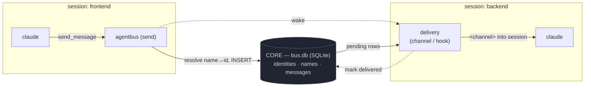

# agentbus

[](https://github.com/biswajitpatra/agentbus/actions/workflows/ci.yml)
[](LICENSE)

A **local message bus for AI agent sessions**. Start two Claude Code sessions and
one can message the other — the message lands **in the recipient's running
session** as a `<channel>` event. No copy-paste, no daemon, no network.


agentbus is a few clean layers (see **[SPEC.md](SPEC.md)**):

1. **core** — the bus: one SQLite db (`~/.agentbus/bus.db`). Includes the
   **registry**: stable `identities` (`<runtime>:<token>`, with a live
   `session_id`), a mutable `names` (name → id) map, and `messages` keyed by the
   recipient **id**.
2. **send (MCP) — always on.** One MCP server, `agentbus`: `send_message`,
   `broadcast`, `list_peers`, `whoami`, `set_name`. Universal — every CLI speaks
   MCP. Never drains. For a named session it also registers its identity.
3. **delivery — pluggable, you pick.** How messages land *in* a session.
   Enable individually:
   - `claude-channel` — real-time, mid-turn (file-watch + MCP channel push)
   - `claude-hook` — turn-boundary (Stop/SessionStart hook); works in the agents
     panel with no channel flag, and *registers the identity* for dispatched agents
   - *(future)* `gemini-a2a`, … — independent, can run alongside the Claude ones

Routing keys on the stable **id**; the **name** is just a mutable label — so you
can rename a session after it's started (`set_name`) with zero message migration.



Send (one always-on MCP server) is cleanly separate from receive (the delivery
you choose), so turning a delivery on or off never affects your ability to send,
and one delivery never swallows messages meant for another.

Why not just use A2A? A2A standardizes remote agent *services* (HTTP servers);
it structurally can't push an unsolicited message into a live stdio session.
agentbus does that last mile, and keeps its envelope A2A-shaped so a remote leg
can be added later as just another delivery. (Details in [SPEC.md §9](SPEC.md).)

## Requirements

- [Bun](https://bun.sh)
- Claude Code **v2.1.80+** (channels are a research-preview feature)
- Same machine, same user (the bus is a local SQLite file)

## Install

```bash
git clone https://github.com/biswajitpatra/agentbus
cd agentbus
bash scripts/install.sh
```

This installs deps and registers the always-on `agentbus` send server, then lists
the deliveries. Turn on the one(s) you want:

```bash
bun run agentbus enable claude-channel   # real-time
bun run agentbus enable claude-hook      # turn-boundary; works in the agents panel
bun run agentbus list                    # what's on
bun run agentbus disable claude-channel
```

There's intentionally **no "enable all"** — pick each delivery deliberately.

## Uninstall

```bash
bun run uninstall            # remove the send server + every delivery + the bus
```

Restart any running session to fully drop the loaded server/hook. The cloned
repo is left in place.

## Use

Give each session a name with `AGENTBUS_NAME`. Launch depends on the delivery:

```bash
# claude-channel (real-time): load the channel
AGENTBUS_NAME=frontend claude --dangerously-load-development-channels server:agentbus-channel

# claude-hook (turn-boundary): no flag needed
AGENTBUS_NAME=backend claude
```

(`bun run agentbus launch claude-channel frontend` prints the exact command.)

Now ask `frontend`: *"send_message to backend: what's the API contract?"* —
`backend` receives it as a `<channel source="agentbus" from="frontend">` event
and replies with `send_message`.

You can also drive the bus straight from a shell (no MCP needed) — handy in
scripts and for dispatched agents:

```bash
AGENTBUS_NAME=frontend bun run agentbus send backend "what's the API contract?"
bun run agentbus name api      # (re)claim a name for this session
bun run agentbus peers
```

See [`examples/two-sessions.md`](examples/two-sessions.md) for a full walkthrough.

## Identity & rename

Each session has a stable **id** `<runtime>:<token>` (token = `AGENTBUS_NAME`, or
the runtime's session id). Messages are keyed by id; a **name** is a mutable
label that maps to it. So you can **rename after a session has started** —
`set_name newname` (tool) or `agentbus name newname` (CLI) — and nothing
migrates, because routing was never by name. Claiming a name someone else holds
takes it over (they're notified).

## Using `claude agents`

Dispatched/background sessions can't take the channel flag, but the **hook**
delivery works there — and it registers the agent's identity from the
`session_id` it gets, so you don't need to set any env. Apply your user settings
(which carry the hook) and the send tools to dispatched sessions:

```bash
claude agents --setting-sources user --mcp-config <agentbus-mcp-config>
```

A dispatched agent sends/names itself by shelling out via its Bash tool
(`agentbus send …` / `agentbus name …`) — Bash subprocesses get
`CLAUDE_SESSION_ID`, so the CLI computes the **same** id the hook registered.

## Tools (from the `agentbus` send server)

| Tool | Args | Description |
|------|------|-------------|
| `send_message` | `to`, `text` | Message one peer by name (resolved to its id) |
| `broadcast` | `text` | Message every other online peer |
| `list_peers` | — | Sessions currently online |
| `whoami` | — | This session's name and id |
| `set_name` | `name` | (Re)claim a name for this session |

Incoming messages arrive (via your chosen delivery) as:

```
<channel source="agentbus" from="frontend" msg_id="42" ts="...">
what's the API contract?
</channel>
```

To reply, call `send_message` with `to` set to the `from` value.

## How it works

- **Registry** — a participating session registers an `identities` row (id +
  live `session_id`) and refreshes `last_seen`; a name maps to that id. A peer
  silent for 45s is reaped. Registration is done by the send server (named
  session) or the hook (dispatched agent) — not by each delivery.
- **Send** — `send_message` resolves `name → id`, `INSERT`s into `messages`
  (`recipient = id`, `delivered_at` NULL), and fires a wake. Sending queues for
  *any* id (mailbox semantics), so you can message a peer that's idle or hasn't
  started yet.
- **Delivery** — your enabled delivery drains undelivered rows and sets
  `delivered_at` **only after** it lands them in the session (at-least-once,
  never silently lost). `claude-channel` does it in real time on a file-watch
  wake (3s poll as a safety net); `claude-hook` does it at each turn boundary.
- **Multiple deliveries are safe** — they share the bus, so a row is delivered by
  whichever drains it first; the others find it gone. Duplicates (rare races) are
  deduped on `msg_id`.
- **Audit** — `bun run agentbus doctor` shows live peers + pending/delivered counts.

`claude-channel`'s wake is a per-peer file watched with `fs.watch` — SQLite can't
notify other processes
([`update_hook` is same-process only](https://sqlite.org/c3ref/update_hook.html)),
so cross-session delivery needs an external nudge. Set `AGENTBUS_TRIGGER=poll` to
use an interval instead.

## Data & migrations

Schema is defined with [Drizzle ORM](https://orm.drizzle.team) in
[`core/schema.ts`](core/schema.ts); queries go through [`core/bus.ts`](core/bus.ts).
Versioned migrations live in `drizzle/` and apply automatically on startup:

```bash
# edit core/schema.ts, then:
bun run db:generate     # writes a new drizzle/NNNN_*.sql migration — commit it
```

Inspect the bus directly (it's just SQLite):

```bash
sqlite3 ~/.agentbus/bus.db \
  "SELECT sender, recipient, body, delivered_at FROM messages ORDER BY id DESC LIMIT 10;"
```

## Security

A delivered message is injected into the agent's context — a prompt-injection
surface. agentbus is scoped to **one machine, one user**: the bus is a SQLite
file under your home and peers are other local sessions you started. It listens
on **no network port**. Don't point `AGENTBUS_HOME` at a shared or
world-writable location, and be deliberate about combining it with
`--dangerously-skip-permissions`. See [SECURITY.md](SECURITY.md).

## Project layout

```
core/schema.ts                  Drizzle tables (identities, names, messages)
core/bus.ts                     the bus + registry: SQLite client, migrations, queries
core/identity.ts                id resolution (<runtime>:<token>) + name sanitizing
core/ports.ts                   the standard: Envelope, Trigger, Delivery
core/paths.ts                   where the bus lives (~/.agentbus)
triggers/file-watch.ts          wake-file Trigger (default, event-driven)
triggers/poll.ts                interval Trigger (fallback)
adapters/send.ts                the always-on MCP send server ("agentbus")
adapters/send.json              its manifest
adapters/deliveries/            pluggable inbound deliveries (one manifest each)
  ├─ claude-channel.ts/.json    MCP channel server (file-watch + channel push)
  └─ claude-hook.ts/.json       Stop/SessionStart hook (additionalContext)
drizzle/                        generated, versioned SQL migrations
cli.ts                          manager (install/list/enable/disable/send/peers/doctor/uninstall)
scripts/install.sh              bootstrap: deps + register send + list deliveries
scripts/demo.ts                 self-driving demo (records the README cast)
examples/two-sessions.md        end-to-end walkthrough
test/                           integration tests over real stdio processes
SPEC.md                         the agentbus standard
```

## Prior art

[clauder](https://github.com/MaorBril/clauder) pioneered cross-session messaging
for Claude Code over a shared SQLite store, and
[session-bridge](https://blog.shreyaspatil.dev/session-bridge-i-made-two-claude-code-sessions-talk-to-each-other/)
does it with a file mailbox. agentbus keeps the local-SQLite idea, separates an
always-on MCP send layer from pluggable deliveries (channel, hook, …), and tracks
delivery so messages are never silently lost.

## License

MIT — see [LICENSE](LICENSE).
